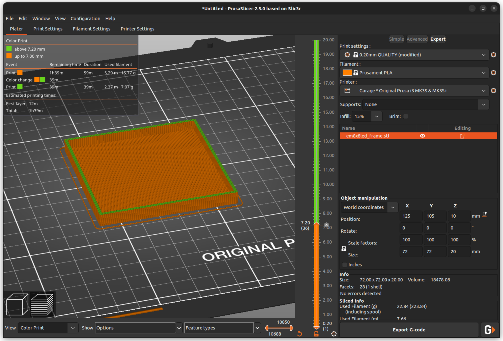
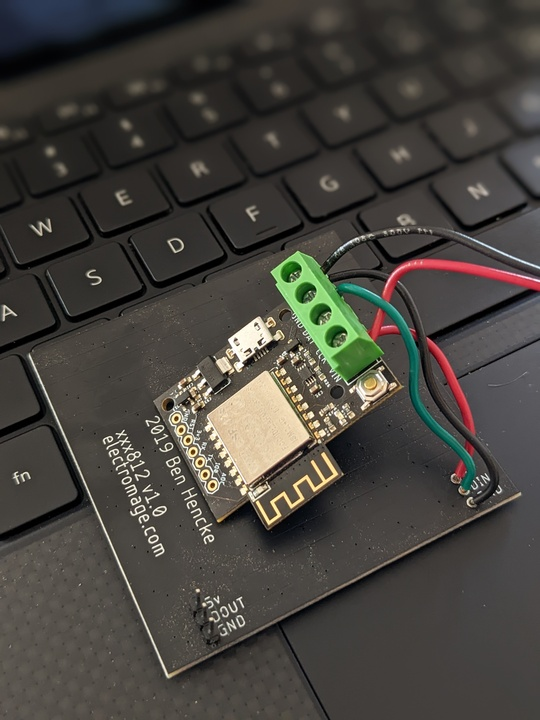
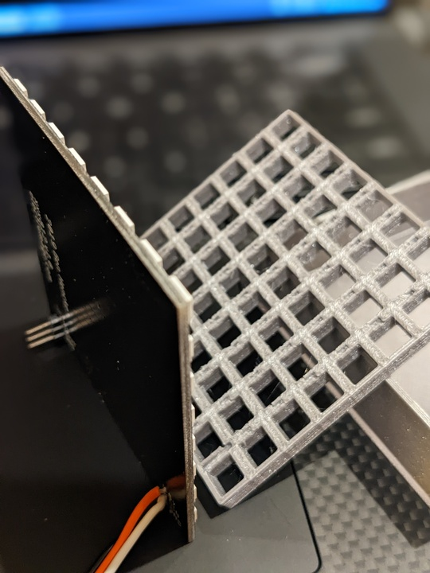
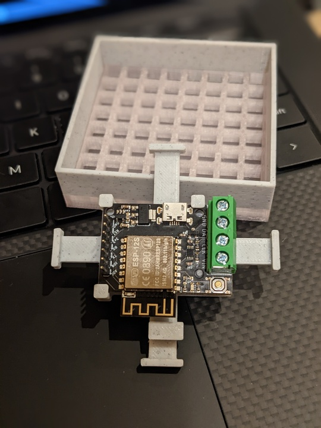
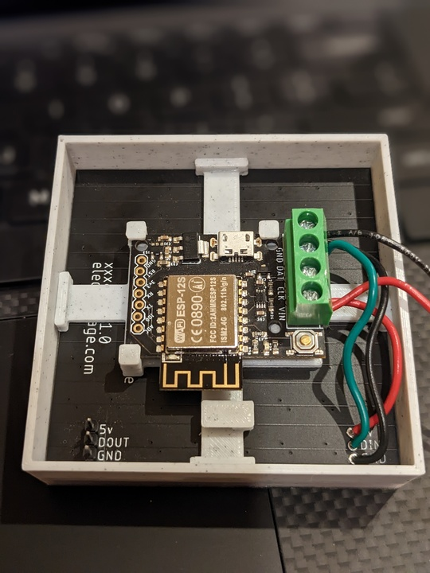

# Pixelblaze and 8x8 Matrix Frame

This 3D printer project provides three parts that go together to form a self-contained holder for a Pixelblaze LED controller and an 8x8 LED matrix (note that other vendor's matrices likely will have different dimensions).

https://user-images.githubusercontent.com/760846/190319472-cfde13ed-4a80-4a48-9cac-1f4001eb9025.mov

The design is written using [OpenSCAD](http://openscad.org/), so you can change whatever you want. You can also use the "Customizer" feature of OpenSCAD to adjust some of the key attributes and generate new STL files.

## Building

You will need the following materials and equipment:

* 1 [Pixelblaze board](https://shop.electromage.com/products/pixelblaze-v3-standard-wifi-led-controller)
* 1 [8x8 LED matrix](https://shop.electromage.com/products/8x8-led-matrix-sk6812)
* Super glue
* Wires to connect from Pixelblaze to LED matrix
* 5V Power Supply
* 3D Printer

### 3D Printing

You can use the supplied STL files or generate your own from the OpenSCAD files. The examples shown below used PLA filament, but you can use whatever you prefer. The examples were sliced with [PrusaSlicer 2.5](https://www.prusa3d.com/page/prusaslicer_424/) with a layer height of 0.2mm.

There are three parts to print:

* em8x8led.stl - 8x8 grid for the LED matrix: no special settings needed
* em8x8led_frame.stl - frame (box) that contains the 8x8 LED matrix and Pixelblaze holder
* em8x8_pb_holder.stl - Pixelblaze holder

The frame contains the front panel through which the 8x8 LED matrix shines. The conventional choice is to use a clear, transparent filament for the front panel (bottom of the box). You can then do a filament (color) change after so many layers to a more opaque color filament for the remainder of the frame. The filament change is done during slicing and depends on the slicer software - directions for [PrusaSlicer](https://help.prusa3d.com/article/color-change_1687) and [Cura Slicer](https://www.instructables.com/How-to-Change-Filament-Mid-print-Using-Cura-48/). The screenshot below shows the process in PrusaSlicer.

If you prefer seeing the LEDs from the side, extend the clear section of the front panel as far up as the depth of the grid - 7mm for the supplied STL files. If you don't want the side "glow", make the color change at 2mm, the depth of the front panel (box bottom). The picture below shows the different effects.

The Pixelblaze holder, which also serves to secure the 8x8 LED matrix in the frame, should be printed with supports. The supports are easily removed with a needle-nose pliers. You may need to run a knife or piece of sandpaper through the slots to make it easier to slip the Pixelblaze PCB in place.

### Assembling

You can use direct wire connections with soldering or use 0.1" pins. The picture below shows one of each. Whichever you choose, make the connections as the first step of assembly.

The picture below shows the order of the parts.

Start by press-fitting the 8x8 LED matrix into the side of the grid that has holes. Note the orientation where the wire connections fit into the longer/bigger holes.

Next, mount the Pixelblaze board (PCB) in the holder slots. Note the orientation with the "peg" on the holder fitting in the hole next to the switch (picture below). The PCB is a friction fit in the slots in the square standoffs.

Try a friction fit of the holder into the frame, up against the back of the 8x8 LED matrix. You could hook up power at this point and see how it all looks before gluing the holder in place. After you are satisfied with the look-n-feel, remove the holder from the frame. Apply super glue to the ends of the pads on the holder and press the holder back into place and allow time for the glue to dry.

The 8x8 LED matrices can be chained together, as in the video above. In this use case, just use one Pixelblaze and leave the other frame holder empty.

## Variations

You can achieve different looks by varying some of the project properties:

* Depth of the grid
* Color of the grid - note the two in the video: the left is a clear grid while the right is opaque
* Depth of side panel - see the lights from the side as visible in the video
